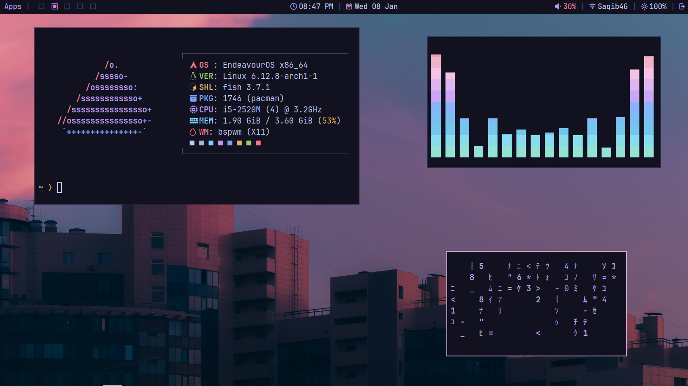
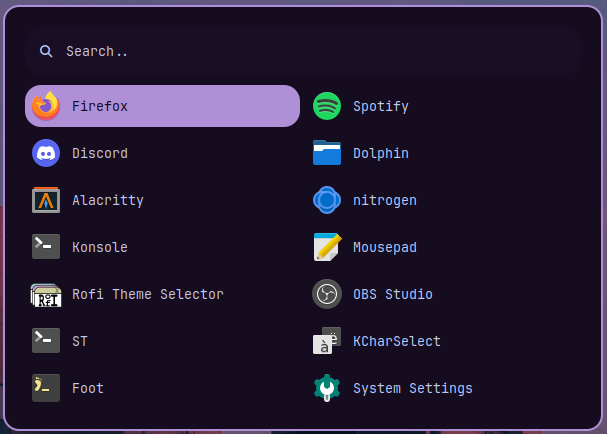

# BSPWM DOTFILES
These are dotfiles for the bspwm window manager, along with other things.\
all of these are themed with my modified version of tokyo night color scheme.\
these are completely free to reproduce and use in your own repos.
## Packages
Arch Linux:
```
sudo pacman -S bspwm picom xclip alacritty dunst nitrogen sxhkd rofi polybar scrot dunst fish starship
```
You also need rofi power menu for the power button on Polybar.
## Screenshots:
### BSPWM, Picom and Polybar




### Neovim


### Alacritty and Starship


### Dunst


### Rofi


