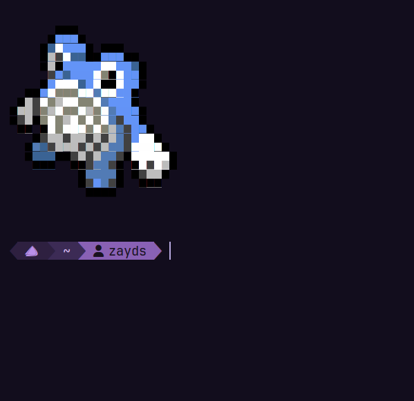

# BSPWM DOTFILES
These are dotfiles for the bspwm window manager, along with other things.\
all of these are themed with my modified version of tokyo night color scheme.\
these are completely free to reproduce and use in your own repos.
## Packages
Arch Linux:
```
sudo pacman -S bspwm picom xclip dunst nitrogen sxhkd rofi polybar scrot dunst fish starship
```
You also need rofi power menu for the power button on Polybar.
## How do i use these dotfiles?
First, if you have any of these folders in your .config folder at $HOME/.config, than you will need to delete them.\
The following directories that must **NOT** be there:
```
bspwm
dunst
fish
nitrogen
nvim
picom
polybar
rofi
sxhkd
```
Then you're ready for the next step. Then,\
Clone this repo with this command:
```
git clone https://github.com/linux-rooster/bspwm-dotfiles.git
```
Then `cd` into the directory:
```
cd bspwm-dotfiles
```
Then copy the folders with this commmand:
```
cp -r alacritty bspwm dunst fish nitrogen nvim picom polybar rofi sxhkd
```
Now all theese dotfiles are installed on your system.\
But there's still the terminal (st) left.\
Setup is a bit more complex.\
First, clone ST's repo on your machine.
```
git clone https://git.suckless.org/st
```

Next, cd into the "st" directory and remove the "config.def.h" file.

```
cd st
rm -f config.def.h
```

Now, get the "config.h" file from MY dotfiles repo and put it in the st directory.

```
cp /path/to/the/cloned/repo/st/config.h . # dot means the current working directory, which is the st folder.
```

Next, build the program.

```
sudo make install
```

However, don't launch it *yet*.\
ST doesn't have  mouse scrolling by default, so we need to "patch" it.\
First, create a directory in the st folder called "patches"

```
mkdir patches
```

Then, cd into the patches folder and copy the two patch files from the ST folder in my dotfiles repo. We need a patch called "st-scrollback-20210507-4536f46.diff" for the main patch and "st-scrollback-mouse-20220127-2c5edf2.diff" to enable mouse scrolling as well.

```
cd patches
cp /path/to/the/cloned/dotfiles/repo/st/st-scrollback-20210507-4536f46.diff . # the dot simply means the current directory you're in. which in our case, is the patches folder.
cp /path/to/the/cloned/repo/st/patches/st-scrollback-mouse-20220127-2c5edf2.diff .
```

Now go bck to the "st" folder and patch the terminal using the patch files with the "patch" command.

```
cd ..
patch -p1 < patches/st-scrollback-20210507-4536f46.diff
patch -p1 < patches/st-scrollback-mouse-20220127-2c5edf2.diff
```
Now, just do a clean install of st again.

```
sudo make clean install
```

And you're done!


## Screenshots:
### BSPWM, Picom and Polybar


### Neovim
You will need to install packer.nvim from their installation guide, then once you've gotten the init.lua, run :PackerSync.\


### ST, Starship and fish



### Dunst


### Rofi


