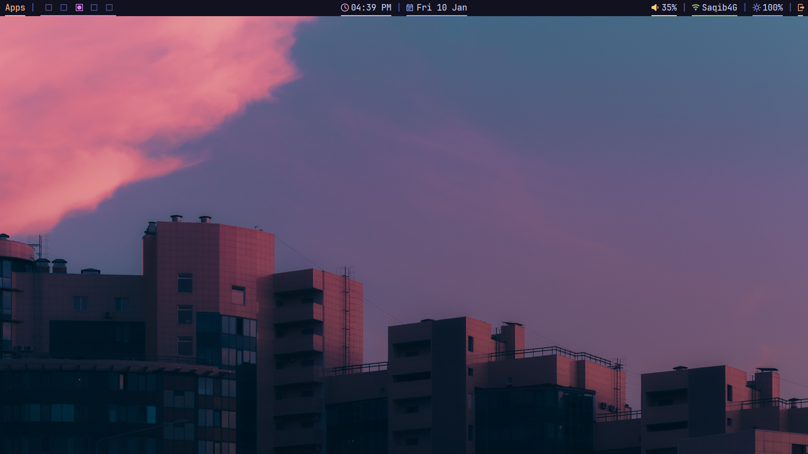
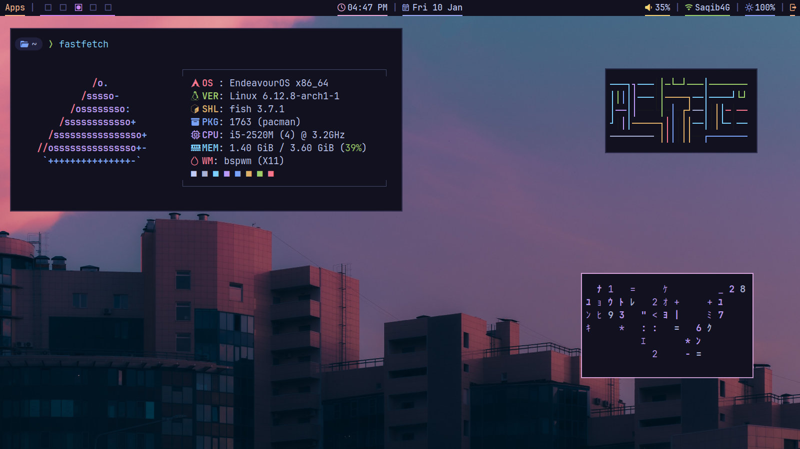
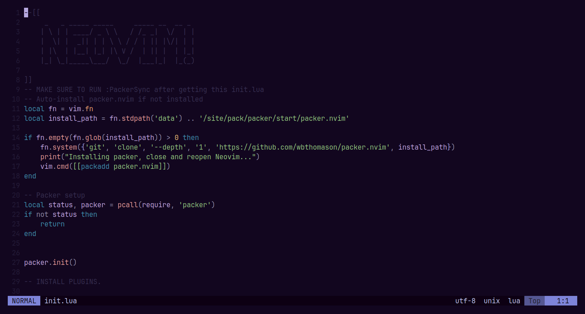
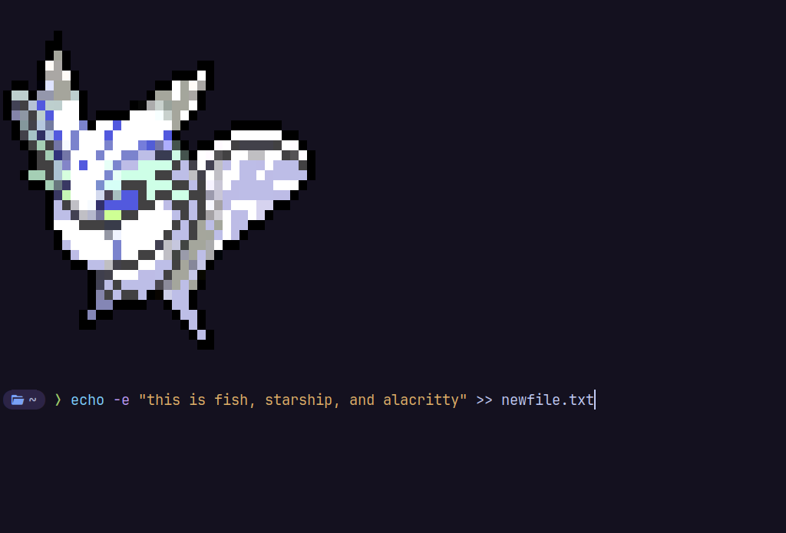
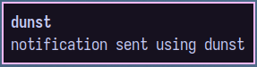
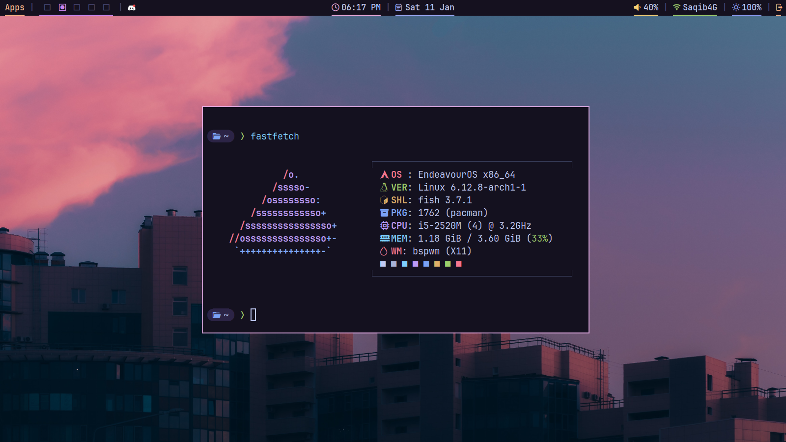

# BSPWM DOTFILES
These are dotfiles for the bspwm window manager, along with other things.\
all of these are themed with my modified version of tokyo night color scheme.\
these are completely free to reproduce and use in your own repos.
## Packages
Arch Linux:
```
sudo pacman -S bspwm picom xclip alacritty dunst nitrogen sxhkd rofi polybar scrot dunst fish starship
```
You also need rofi power menu for the power button on Polybar.
## How do i use these dotfiles?
First, if you have any of these folders in your .config folder at $HOME/.config, than you will need to delete them.\
The following directories that must **NOT** be there:
```
alacritty
bspwm
dunst
fish
nitrogen
nvim
picom
polybar
rofi
sxhkd
```
Then you're ready for the next step. Then,\
Clone this repo with this command:
```
git clone https://github.com/linux-rooster/bspwm-dotfiles.git
```
Then `cd` into the directory:
```
cd bspwm-dotfiles
```
Then copy the folders with this commmand:
```
cp -r alacritty bspwm dunst fish nitrogen nvim picom polybar rofi sxhkd
```
Now all theese dotfiles are installed on your system.
## Screenshots:
### BSPWM, Picom and Polybar





### Neovim
You will need to install packer.nvim from their installation guide, then once you've gotten the init.lua, run :PackerSync.\



### Alacritty, Starship and fish



### Dunst



### Rofi


